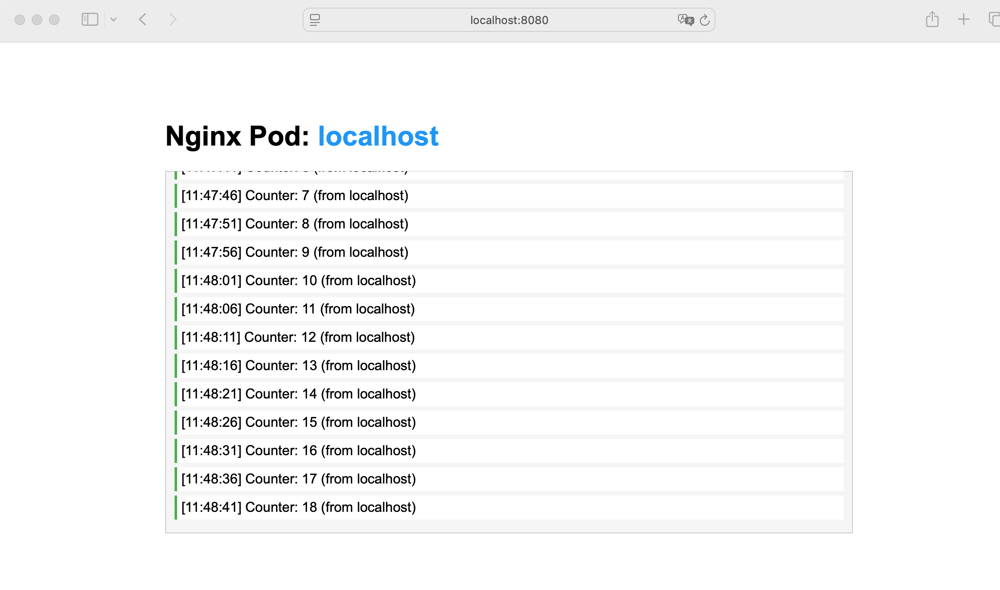

# pods behavior

## demo screenshot



## setup

0. have Docker Desktop running and Kubernetes cluster capability enabled
1. `kubectl apply -f nginx-setup.yml`
2. expect to see one nginx pods when executing command `kubectl get pods`

## content

|||
|-|-|
|ConfigMap:| Contains the HTML with JavaScript that counts every 5 seconds|
|Deployment:| Creates 1 nginx pod replicas|
|Service:| LoadBalancer that distributes traffic between the pods|

# Kubernetes Pod Testing Scenarios

## Setup
First, ensure your deployment is running:
```bash
kubectl apply -f nginx-setup.yml
```

---

## Scenario 1: Delete Pod with 1 Replica (Expect 503 Error)

### Goal
Demonstrate service disruption when the only pod is deleted.

### Steps

1. **Scale to 1 replica:**
   ```bash
   kubectl scale deployment nginx-deployment --replicas=1
   ```

2. **Verify only 1 pod is running:**
   ```bash
   kubectl get pods -l app=nginx
   ```
   Expected output:
   ```
   NAME                                READY   STATUS    RESTARTS   AGE
   nginx-deployment-xxxxx              1/1     Running   0          10s
   ```

3. **Open webpage in browser:**
   - Navigate to `http://localhost:8080`
   - Note the pod name displayed
   - Observe the counter incrementing every 5 seconds

4. **Open monitoring terminal:**
   ```bash
   kubectl get pods -l app=nginx -w
   ```

5. **Delete the pod:**
   ```bash
   # Get the exact pod name
   POD_NAME=$(kubectl get pods -l app=nginx -o jsonpath='{.items[0].metadata.name}')
   
   # Delete it
   kubectl delete pod $POD_NAME
   ```

6. **Immediately refresh browser:**
   - **Expected:** 503 Service Unavailable or connection error
   - The page should fail to load

7. **Observe pod lifecycle:**
   ```
   NAME                                READY   STATUS        RESTARTS   AGE
   nginx-deployment-xxxxx              1/1     Terminating   0          2m
   nginx-deployment-yyyyy              0/1     Pending       0          0s
   nginx-deployment-yyyyy              0/1     ContainerCreating   0     1s
   nginx-deployment-yyyyy              0/1     Running       0          3s
   nginx-deployment-yyyyy              1/1     Running       0          13s
   nginx-deployment-xxxxx              0/1     Terminating   0          2m33s
   ```

8. **Wait and retry browser:**
   - After ~10 seconds, refresh browser
   - **Expected:** Page loads again with a NEW pod name
   - Counter starts from 1 again

### Key Observations
- **Downtime:** ~10-40 seconds (while new pod becomes Ready)
- **Old pod:** Takes 30 seconds to fully terminate (preStop hook)
- **New pod:** Takes ~10 seconds to become Ready (readiness probe)

---

## Scenario 2: Delete Pod with 2 Replicas (No Downtime)

### Goal
Demonstrate zero-downtime with multiple replicas and LoadBalancer failover.

### Steps

1. **Scale to 2 replicas:**
   ```bash
   kubectl scale deployment nginx-deployment --replicas=2
   ```

2. **Verify 2 pods are running:**
   ```bash
   kubectl get pods -l app=nginx
   ```
   Expected output:
   ```
   NAME                                READY   STATUS    RESTARTS   AGE
   nginx-deployment-xxxxx              1/1     Running   0          30s
   nginx-deployment-yyyyy              1/1     Running   0          30s
   ```

3. **Open webpage in browser:**
   - Navigate to `http://localhost:8080`
   - Note the pod name (e.g., `nginx-deployment-xxxxx`)

4. **Open a second browser tab:**
   - Navigate to `http://localhost:8080` again
   - You might see the same or different pod name
   - Keep both tabs open and visible

5. **Start continuous monitoring:**
   ```bash
   # Terminal 1: Watch pods
   kubectl get pods -l app=nginx -w
   
   # Terminal 2: Continuously check which pod responds
   while true; do curl -s http://localhost:8080/api/hostname; sleep 1; done
   ```

6. **Delete one specific pod:**
   ```bash
   # Choose one pod to delete (replace with actual name)
   kubectl delete pod nginx-deployment-xxxxx
   ```

7. **Observe in browser tabs:**
   - **Tab connected to deleted pod:** Counter might stop or show error
   - **Tab connected to other pod:** Continues working normally
   - Refresh the failed tab: It should now connect to the surviving pod

8. **Observe curl output:**
   ```
   nginx-deployment-xxxxx
   nginx-deployment-yyyyy
   nginx-deployment-xxxxx   <-- This pod is being deleted
   nginx-deployment-yyyyy
   nginx-deployment-yyyyy   <-- All traffic now goes to surviving pod
   nginx-deployment-zzzzz   <-- New replacement pod becomes Ready
   nginx-deployment-yyyyy
   nginx-deployment-zzzzz   <-- Load balancing resumes
   ```

9. **Watch pod replacement:**
   ```
   NAME                                READY   STATUS        RESTARTS   AGE
   nginx-deployment-xxxxx              1/1     Terminating   0          5m
   nginx-deployment-yyyyy              1/1     Running       0          5m
   nginx-deployment-zzzzz              0/1     Pending       0          0s
   nginx-deployment-zzzzz              0/1     ContainerCreating   0     1s
   nginx-deployment-zzzzz              0/1     Running       0          3s
   nginx-deployment-zzzzz              1/1     Running       0          13s
   nginx-deployment-xxxxx              0/1     Terminating   0          5m33s
   ```

### Key Observations
- **No service downtime:** One pod always available
- **LoadBalancer behavior:** Automatically routes to healthy pod
- **Graceful replacement:** New pod ready before old pod fully terminates
- **Client experience:** Some connections may fail, but service remains available

---

## Scenario 3: Rollout Restart with 1 Replica

### Goal
Demonstrate controlled pod restart with minimal downtime using rolling update strategy.

### Steps

1. **Ensure 1 replica:**
   ```bash
   kubectl scale deployment nginx-deployment --replicas=1
   ```

2. **Verify current state:**
   ```bash
   kubectl get pods -l app=nginx
   ```
   Expected output:
   ```
   NAME                                READY   STATUS    RESTARTS   AGE
   nginx-deployment-xxxxx              1/1     Running   0          2m
   ```

3. **Open webpage in browser:**
   - Navigate to `http://localhost:8080`
   - Note the current pod name
   - Watch the counter incrementing

4. **Start monitoring:**
   ```bash
   # Terminal 1: Watch pods with timestamps
   kubectl get pods -l app=nginx -w
   
   # Terminal 2: Monitor rollout status
   kubectl rollout status deployment nginx-deployment -w
   
   # Terminal 3: Check service endpoints
   kubectl get endpoints nginx-loadbalancer -w
   ```

5. **Trigger rollout restart:**
   ```bash
   kubectl rollout restart deployment nginx-deployment
   ```
   Output:
   ```
   deployment.apps/nginx-deployment restarted
   ```

6. **Observe the rollout process:**
   ```
   NAME                                READY   STATUS        RESTARTS   AGE
   nginx-deployment-xxxxx              1/1     Running       0          5m
   nginx-deployment-yyyyy              0/1     Pending       0          0s
   nginx-deployment-yyyyy              0/1     ContainerCreating   0     0s
   nginx-deployment-yyyyy              0/1     Running       0          2s
   nginx-deployment-yyyyy              1/1     Running       0          12s   <-- NEW POD READY
   nginx-deployment-xxxxx              1/1     Terminating   0          5m12s <-- OLD POD TERMINATING
   nginx-deployment-xxxxx              0/1     Terminating   0          5m42s
   nginx-deployment-xxxxx              0/1     Terminating   0          5m43s
   ```

7. **Monitor rollout status output:**
   ```
   Waiting for deployment "nginx-deployment" rollout to finish: 1 old replicas are pending termination...
   Waiting for deployment "nginx-deployment" rollout to finish: 1 old replicas are pending termination...
   deployment "nginx-deployment" successfully rolled out
   ```

8. **Observe browser behavior:**
   - **Before new pod Ready (~10 sec):** Page continues working normally
   - **After new pod Ready:** Page still works (both pods briefly available)
   - **During old pod termination:** Service continues (new pod handling traffic)
   - **After refresh:** New pod name displayed

9. **Verify rollout history:**
   ```bash
   kubectl rollout history deployment nginx-deployment
   ```
   Output:
   ```
   REVISION  CHANGE-CAUSE
   1         <none>
   2         <none>
   ```

10. **Check the new pod is serving:**
    ```bash
    curl http://localhost:8080/api/hostname
    ```

### Key Observations
- **Brief period with 2 pods:** During rollout, both old and new pod exist
- **Minimal downtime:** New pod becomes Ready before old pod terminates
- **Graceful transition:** Old pod gets 30 seconds to finish requests (preStop)
- **Total transition time:** ~40 seconds (10s readiness + 30s preStop)
- **Service availability:** Mostly available, possible brief disruption during endpoint updates

### Rollout Timeline
```
T+0s:   Rollout restart triggered
T+0s:   New pod created (Status: Pending)
T+2s:   New pod container starts (Status: Running, Ready: 0/1)
T+12s:  New pod passes readiness probe (Ready: 1/1)
T+12s:  LoadBalancer adds new pod to endpoints
T+12s:  Old pod receives SIGTERM, preStop hook runs
T+12s:  Old pod creates /tmp/shutting-down (returns 503)
T+42s:  Old pod preStop completes, pod terminates
T+42s:  Rollout complete
```

---

## Additional Testing Commands

### Force Delete a Pod (No Grace Period)
```bash
kubectl delete pod $POD_NAME --force --grace-period=0
```
**Warning:** This bypasses the preStop hook and terminates immediately.

### Scale Up/Down Quickly
```bash
# Scale to 3
kubectl scale deployment nginx-deployment --replicas=3

# Scale to 0 (all pods down)
kubectl scale deployment nginx-deployment --replicas=0

# Scale back to 2
kubectl scale deployment nginx-deployment --replicas=2
```

### Check Service Endpoints in Real-Time
```bash
kubectl get endpoints nginx-loadbalancer -o yaml
```

### Test Load Distribution
```bash
# Hit the service 20 times and see pod distribution
for i in {1..20}; do 
  echo "Request $i: $(curl -s http://localhost:8080/api/hostname)"
  sleep 0.5
done
```

### View Pod Events
```bash
kubectl describe pod $POD_NAME
```

---

## Troubleshooting

### Pod Stuck in Terminating
If a pod stays in Terminating state beyond 30 seconds:
```bash
kubectl delete pod $POD_NAME --force --grace-period=0
```

### Service Not Accessible
Check if LoadBalancer has external IP:
```bash
kubectl get svc nginx-loadbalancer
```

### Pods Not Becoming Ready
Check readiness probe status:
```bash
kubectl describe pod $POD_NAME | grep -A 10 Readiness
```

### View Full Pod Logs
```bash
kubectl logs $POD_NAME -f
```