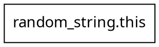
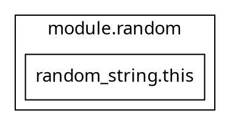

# Terraform: Best Practices and Anti-Patterns

## 1. How Terraform Works as a Declarative Tool
Terraform is an infrastructure as code (IaC) tool that operates declaratively. This means you describe the desired final state of your infrastructure in configuration files, and Terraform determines the actions needed to reach that state. You do not specify the execution order or intermediate steps: you simply declare what you want, and Terraform figures out the "how".

## 2. Why Developers Sometimes Use Imperative Programming (Without Bad Intent)
Despite Terraform's declarative philosophy, developers sometimes introduce imperative logic, often without bad intent. This can happen for several reasons:
- **Habit**: Many developers come from scripting backgrounds (Bash, Python, etc.) where execution order is crucial.
- **Desire for control**: Sometimes, people want to force the creation order of resources to avoid errors or conflicts.
- **Lack of knowledge**: Some are not aware of all the features offered by Terraform, such as loops, expressions, or implicit dependencies.

This often leads to anti-patterns like overusing `depends_on` or duplicating modules to simulate loops.

## 3. Why Using Modules Is Often Not Necessary
Modules are useful for factoring and reusing code, but they are not required for every resource or repetitive logic. Terraform allows you to loop over resources or blocks using `for_each` or `count`, which is often simpler and more readable. Overusing modules can make code more complex, less maintainable, and introduce artificial dependencies.

## 4. Graphs Presentation and Explanation

### Recommended Graph
The dependency graph in the `recommended/` folder shows a flat, parallel structure: each resource (for example, a random ID or a death date) is created independently for each student. There are no forced dependencies between students: everything is managed declaratively and efficiently.




### Anti-Pattern Graph
In the `anti-pattern/` folder, the graph shows a sequential or "chained" structure. Each module is instantiated separately and explicitly depends on the previous one via `depends_on`. This forces an unnecessary execution order, slows down the apply, and goes against Terraform's declarative philosophy.




#### Explanation
- **Recommended**: Resources are created in parallel, without artificial dependencies. This is efficient, maintainable, and in line with Terraform's spirit.
- **Anti-pattern**: Resources are chained, introducing unnecessary dependencies and complicating the execution graph. This can also create cycles or bottlenecks.

---

**In summary**: Always favor the declarative approach, use Terraform's native loops, and only use modules for real code reuse. Avoid introducing imperative dependencies unless absolutely necessary.

---


## Appendix: How to Run and Visualize This Example

> **Note:** No real infrastructure or cloud resources will be provisioned by these examples. All outputs are simple strings generated and displayed in the terminal.

### 1. Initialize and Apply Terraform

Run these commands in each directory (`recommended/` and `anti-pattern/`):

```sh
# Initialize Terraform (run once per directory)
terraform init

# Apply the configuration (outputs only strings, no resources are created)
terraform apply
```

### 2. Generate the Dependency Graphs

After running `terraform init`, you can generate the dependency graphs as DOT files:

```sh
# For the recommended folder
terraform graph > graph_recommended.dot

# For the anti-pattern folder
terraform graph > graph_anti_pattern.dot
```
